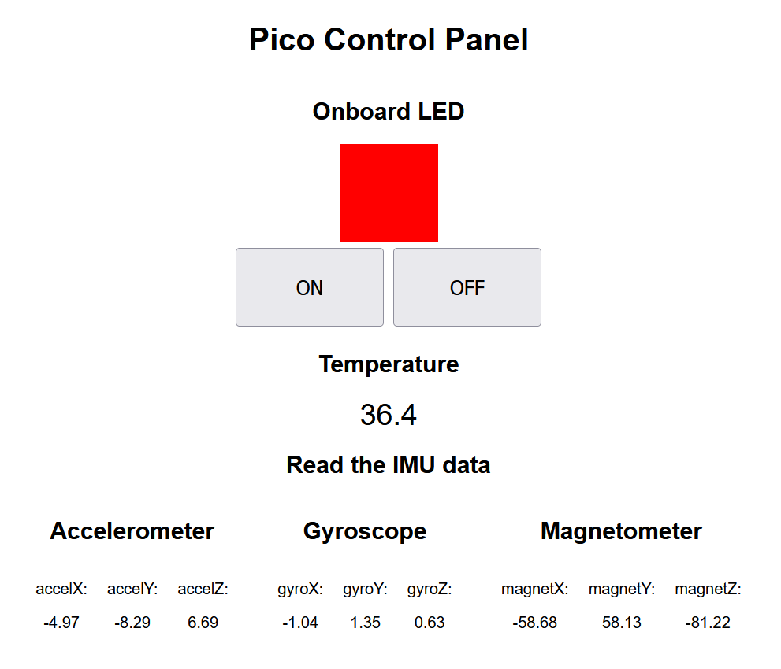
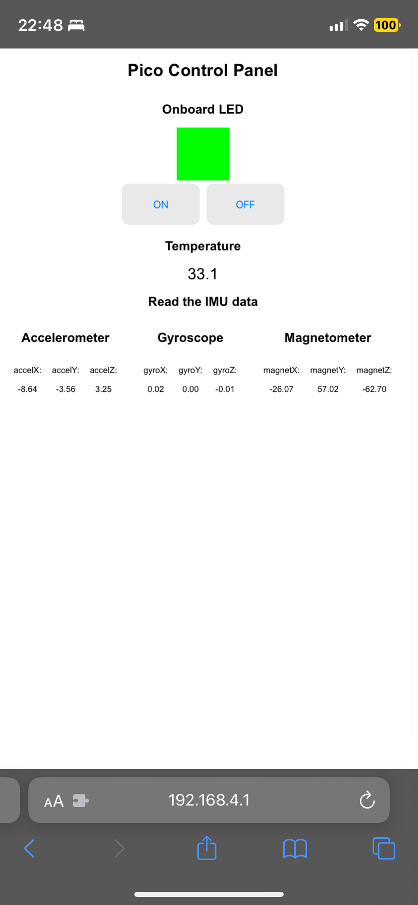

# Master Thesis project - "Step estimation from motion sensors" w/ RPi Pico W

## Overview

The objective of this project is to create a circuit to measure and analyse the data from two different IMUs (Inertial Measurement Units) in order to determine the accuracy of the step estimation algorithm.

## Required components

The project will make use of a variety of components:

- [Raspberry Pi Pico W](https://www.raspberrypi.com/documentation/microcontrollers/raspberry-pi-pico.html) (access point, web server, reading sensors, driving TFT display) running [MicroPython](https://micropython.org/download/RPI_PICO/) with various [CircuitPython Libraries](https://learn.adafruit.com/circuitpython-libraries-on-micropython-using-the-raspberry-pi-pico/overview) (short tutorial in `.BACKUP/adafiut_libs/README.md` and board pinout in `.BACKUP/pico-pinout.svg`),
- [Pico-10DOF-IMU](https://www.waveshare.com/wiki/Pico-10DOF-IMU) as the first IMU,
- [ST-9-DOF-Combo](https://learn.adafruit.com/st-9-dof-combo) as the second IMU,
- [Pico-UPS-B](https://www.waveshare.com/wiki/Pico-UPS-B) as a power source,
- [3.5inch_TFT_Touch_Shield](https://www.waveshare.com/wiki/3.5inch_TFT_Touch_Shield) to display the measurements and battery level,
- [Pico-Dual-Expander](https://www.waveshare.com/pico-dual-expander.htm) to hold some components together w/o soldering,
- 3D printed enclosure for the device to protect the circuit (custom design).

## Progress

### First major success:

I managed to create an asynchronous web server that handles clients and reads sensor data at the same time (based on a scheduler, multithreading-coming-soon&trade;). Notable achievements of this release:

- Pico acting as an access point,
- Handling of asynchronous requests,
- Added translation layer for CircuitPython,
- Reading IMU sensor data using the CircuitPython library (LSM6DSOX + LIS3MDL 9 DoF),
- Control the device from a web page,
- Live UI update and synchronous data retrieval.

  
  

