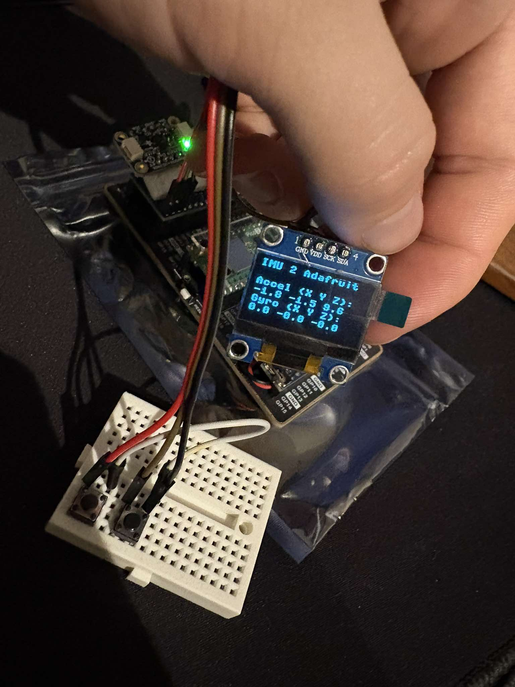
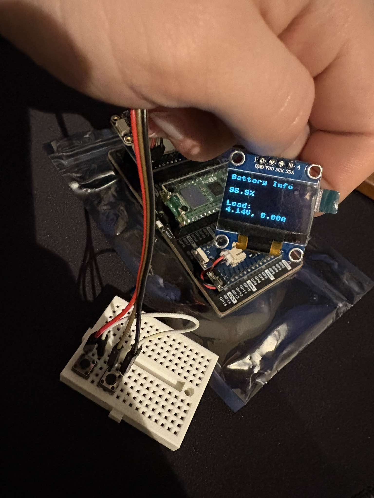

# Master thesis project - "Step estimation from motion sensors" with RPi Pico 2 W

<br/>
<br/>

<div align='center'>

[](https://github.com/revalew/Master-Thesis/blob/master/LICENSE)

[](https://github.com/revalew/Master-Thesis)
[](https://github.com/revalew/Master-Thesis)

[](https://github.com/revalew/Master-Thesis) [](https://github.com/revalew/Master-Thesis)

</div>

<br/>

<!-- > [!NOTE]
>
> Repo size heavily affected by useless stuff and multiple plots (don't care)
>
> ```
> (^_^) [maks: Master-Thesis] (master) > du -sh --exclude=venv --exclude=.git --exclude=.mypy_cache . && find . -type f -not -path "*/.git/*" -not -path "*/venv/*" -not -path "*/.mypy_cache/*" -exec du -h {} + | sort -rh | head -10
> 86M     .
> 16M     ./.BACKUP/adafiut_libs/adafruit-circuitpython-bundle-py-20240709.zip
> 5,7M    ./.BACKUP/project_circuit_simple_diagram.pdf
> 4,0M    ./.BACKUP/OLD_project_circuit_simple_diagram.pdf
> 2,6M    ./.BACKUP/Firmware/Pico 2W/adafruit-circuitpython-raspberry_pi_pico2_w-pl-9.2.4.uf2
> 2,4M    ./.BACKUP/Firmware/Pico 2W/pico2_w-v0.0.12-pimoroni-micropython.uf2
> 2,1M    ./.BACKUP/PL_masters_degree_seminar/prezentacja_magisterska_3_MK.pdf
> 1,7M    ./.BACKUP/pinout/PicoW-A4-Pinout.pdf
> 808K    ./.BACKUP/pinout/pico-2-w-pinout.pdf
> 740K    ./.BACKUP/pinout/pico-pinout.svg
> 668K    ./.BACKUP/PL_masters_degree_seminar/prezentacja_magisterska_2_MK.pdf
> ```

<br/>
<br/> -->

> [!CAUTION]
>
> After the migration to the `Pico 2 W`, the project might not be compatible with the original `Pico W` anymore. The `Pico 2 W` has more RAM and storage to handle additional devices and resources.
>
> To run the project on the original `Pico W`, you might need to modify the code to work with the `Pico W` instead of the `Pico 2 W`. This could include removing some devices (like OLED display), libraries or lines of code (docs and whitespaces) to save both RAM and storage.
>
> Try uploading the compiled libraries to the `Pico W` and see if it works. If it doesn't, you might need to modify the code to work with the `Pico W` and recompile the libraries.

<br/>
<br/>

## Overview

<br/>

The aim of this project is to create a circuit to measure and analyze the data from two different IMUs (Inertial Measurement Units) to determine the accuracy of the step estimation algorithm (multiple if there is time).

This project was developed by Maksymilian Kisiel as part of a Master's Thesis at Silesian University of Technology, under the supervision of dr hab. inż. Agnieszka Szczęsna, prof. PŚ.

<br/>
<br/>

## Table of contents

<br/>

- [Required / used components](#required--used-components)

- [How to connect the components](#how-to-connect-the-components)

- [Project structure and important locations](#project-structure-and-important-locations)

- [Progress](#progress)

  - [First major success](#first-major-success)

  - [Migration to Pico 2 W](#migration-to-pico-2-w)

  - [Compiling the libraries for Pico 2 W (`.py` to `.mpy`)](#compiling-the-libraries-for-pico-2-w-py-to-mpy)

  - [Converting the breadboard circuit into a "HAT" for the Pico 2 W](#converting-the-breadboard-circuit-into-a-hat-for-the-pico-2-w)

  - [Gathering data and analyzing it](#gathering-data-and-analyzing-it)

  - [Minor improvements and new metrics](#minor-improvements-and-new-metrics)

  - [Added UDP support](#added-udp-support)

  - [Algorithm Improvements](#algorithm-improvements)

<br/>
<br/>

## Required / used components

<br/>

The project will make use of a variety of components:

<br/>

- [Raspberry Pi `Pico W` / `Pico 2 W`](https://www.raspberrypi.com/documentation/microcontrollers/raspberry-pi-pico.html) (access point, web server, reading sensors, driving TFT display) running [MicroPython](https://micropython.org/download/RPI_PICO/) with various [CircuitPython Libraries](https://learn.adafruit.com/circuitpython-libraries-on-micropython-using-the-raspberry-pi-pico/overview),

<br/>

- [Pico-10DOF-IMU](https://www.waveshare.com/wiki/Pico-10DOF-IMU) as the first IMU,

<br/>

- [ST-9-DOF-Combo](https://learn.adafruit.com/st-9-dof-combo) as the second IMU,

<br/>

- [Pico-UPS-B](https://www.waveshare.com/wiki/Pico-UPS-B) as a power source,

<br/>

- [0.96inch_OLED_Module](https://www.waveshare.com/wiki/0.96inch_OLED_Module) to display the measurements and battery level (I used no-name super-cheap I2C `128x64` OLED display marked as [`gm009605v4.2`](https://allegro.pl/oferta/wyswietlacz-oled-0-96-i2c-ssd1306-bialy-17251217815), originally planned to use [3.5inch_TFT_Touch_Shield](https://www.waveshare.com/wiki/3.5inch_TFT_Touch_Shield)),

<br/>

- [Pico-Dual-Expander](https://www.waveshare.com/pico-dual-expander.htm) to hold some components together w/o soldering,

<br/>

- 3D printed enclosure for the device to protect the circuit (custom design).

<br/>
<br/>

## How to connect the components

<br/>

Simple list of connections in [`~/.BACKUP/project_circuit_simple_diagram.pdf`](./.BACKUP/project_circuit_simple_diagram.pdf)

<br/>

```
┌───────────────────────┐     ┌────────────────────┐
│ Raspberry Pi Pico 2W  │     │                    │
│  ┌────────────────┐   │     │  Data Processing   │
│  │ MicroPython    │   │     │  (PC)              │
│  │ + Adafruit     │   │     │                    │
│  │   Blinka       ├───┼────►│  - Data Analysis   │
│  └────────────────┘   │     │  - Visualization   │
│  ┌────────────────┐   │     │  - Algorithm       │
│  │ HTTP Server    │   │     │    Comparison      │
│  │ + REST API     │   │     │                    │
│  └────────────────┘   │     │                    │
└───────────┬───────────┘     └────────────────────┘
            │
┌───────────▼───────────┐
│  Web Interface/GUI    │
│                       │
│  - Real-time preview  │
│  - Step marking       │
│  - Data saving        │
└───────────────────────┘
```

<br/>
<br/>

## Project structure and important locations

<br/>

This project consists of many files and directories, the most important of which are described below:

<br/>

- Directory [`~/.BACKUP/`](./.BACKUP/) containing the backup and important files that should not be transferred to the Pico:

  - Adding the CircuitPython compatibility layer - short tutorial in [`~/.BACKUP/adafiut_libs/README.md`](./.BACKUP/adafiut_libs/README.md) (with required libraries in the same directory),

  - Raspberry Pi `Pico W` and `Pico 2 W` board pinout in [`~/.BACKUP/pinout/`](./.BACKUP/pinout/) directory,

  - Firmware used in the project (for both `Pico W` and `Pico 2 W`) in [`~/.BACKUP/Firmware/`](./.BACKUP/Firmware/) directory:

    - Pico W: [`~/.BACKUP/Firmware/Pico%20W/RPI_PICO-20240602-v1.23.0.uf2`](./.BACKUP/Firmware/Pico%20W/RPI_PICO-20240602-v1.23.0.uf2),

    - Pico 2 W: [`~/.BACKUP/Firmware/Pico%202W/pico2_w-v0.0.12-pimoroni-micropython.uf2`](./.BACKUP/Firmware/Pico%202W/pico2_w-v0.0.12-pimoroni-micropython.uf2),

  - [`~/.BACKUP/code/`](./.BACKUP/code/) for old / sample / backup code,

  - **(LINUX USERS: MicroPico Extension for VSCode)** script used to resolve user permissions in [`~/.BACKUP/solvePermissions.sh`](./.BACKUP/solvePermissions.sh),

<br/>

- [`~/libs_to_compile/`](./libs_to_compile/) - Directory containing all the libraries (before compilation) and instructions on how to compile them along with the scripts to do it. The scripts also work with the symlinked libraries (read the [README](./libs_to_compile/README.md) there),

  - [`~/libs_to_compile/lib/`](./libs_to_compile/lib/) - Directory containing the libraries and custom classes (before compilation),

  - [`~/libs_to_compile/lib/classes/`](./libs_to_compile/lib/classes/) - Directory (module) containing all necessary custom-written classes for easy development.

<br/>

- [`~/libs/`](./libs/) directory containing all the CircuitPython libraries after compilation,

<br/>

- [`~/src/`](./src/) directory contains all the resources needed for the web server (HTML, CSS, JS),

<br/>

- [`~/step_detection/`](./step_detection/) - **Step Detection Analysis Module** containing the complete data analysis pipeline (read the [README](./step_detection/README.md) there):

  - [`~/step_detection/step_data_collector.py`](./step_detection/step_data_collector.py) - Main app,

  - [`~/step_detection/utils/`](./step_detection/utils/) - Module containing the GUI application and the implementation of 5 step detection algorithms with performance evaluation,

  - [`~/step_detection/analysis/`](./step_detection/analysis/) - Directory containing analysis results, plots, and example recordings,

  - [`~/step_detection/requirements.txt`](./step_detection/requirements.txt) - Python dependencies for the analysis application,

<br/>

- [`Makefile`](./Makefile) file for automating the `git` workflow (committing, pushing, adding new tags, etc.),

<br/>

- **[`main.py`](./main.py)** as the main file of the project and the program to be executed on startup.

<br/>
<br/>

## Progress

<br/>
<br/>

### First major success

I managed to create an asynchronous web server that handles clients and reads sensor data at the same time (based on a scheduler, multithreading-coming-soon&trade;). Notable achievements of this release:

- Pico acting as an access point,

- Handling of asynchronous requests,

- Added translation layer for CircuitPython,

- Reading IMU sensor data using the CircuitPython library (Adafruit "LSM6DSOX + LIS3MDL 9 DoF" Sensor),

- Control the device from a web page,

- Live UI update and synchronous data retrieval.

<br/>

<div align='center'>
  
</div>
<div align='center'>
  
</div>

<br/>
<br/>

### Migration to Pico 2 W

I moved the project to the Pico 2 W, and it works just fine now using the [`Blinka`](./lib/adafruit_blinka/), [`Platform Detect`](./lib/adafruit_platformdetect/) and other [`CircuitPython`](./lib/) libraries.

Doubled RAM and Flash memory of the Pico 2 W makes it possible to run the project without the fear of low RAM (especially when creating new objects / adding more devices and sending WWW resources) and storage issues (as it was the case with the Pico W, but the `gc.collect()` function is still called everywhere just in case :skull: and all WWW resources don't have any white space).

Added new class [`DebouncedInput.py`](./classes/ResponseBuilder.py) to handle the debouncing of the buttons
This feature is built-in to the standard Python library for the Raspberry Pi like RPi 3/4/5 etc., but not to the MicroPython - `import RPi.GPIO as GPIO; GPIO.add_event_detect(sensor, GPIO.BOTH, bouncetime=300) # signals when the pin goes HIGH/LOW`, full example in [another project](https://github.com/revalew/Plant-Inspector/blob/master/plantinspector.com/public_html/python/sensorDataLogger.py#L138).

Added OLED display (`ssd1306` library) instead of the TFT touch shield to display the measurements and battery level. Separate I2C interface is used to connect the display to the `Pico 2 W`, because it requires `frequency=400000` instead of the default `frequency=100000`. The display starts turned off, but it can be turned on by pressing the button attached to `GP14`. Another button (`GP15`) can be used to cycle through the measurements of the IMU sensors and battery level. The display is updated every 0.5 seconds for the IMUs and 5 seconds for the battery.

Updated the web page to display the measurements and battery level.

<br/>

<div align='center'>

  
  

</div>

<!-- <br/> -->

<div align='center'>

  
  

</div>

<!-- <br/> -->

<div align='center'>

  

</div>

<br/>
<br/>

### Compiling the libraries for Pico 2 W (`.py` to `.mpy`)

The libraries of the project were successfully compiled for the `Pico 2 W` using the script [`./libs_to_compile/mpy_compile_all_libs.sh`](./libs_to_compile/mpy_compile_all_libs.sh) to optimize the size of the libraries and RAM usage. It seems to be faster than before.

The script is in the [`libs_to_compile/`](./libs_to_compile/) directory and it compiles all the libraries in the `libs_to_compile/lib` directory into `../lib/` (root of the project). Instructions for the script can be found in the [`./libs_to_compile/README.md`](./libs_to_compile/README.md) file.

<br/>
<br/>

### Converting the breadboard circuit into a "HAT" for the Pico 2 W

I finally converted the breadboard circuit into a "HAT" for the Pico 2 W and it works just fine now.
It is far from perfect and definitely not my finest work, but it works.
I also fixed the button detection, and now the interrupts work as intended, at least from my tests.

Now I have to create an enclosure and print it.

<br/>

<div align='center'>
  
</div>

<br/>
<br/>

### Gathering data and analyzing it

Successfully implemented and tested the complete step detection pipeline.

For more information about the app and algorithms check out the [`step_detection/`](./step_detection/) directory.

Major achievements of this stage:

- **Step Detection GUI Application**: Created a comprehensive Python application (`step_data_collector.py`) for real-time data collection and analysis with live plotting capabilities,

- **Multiple Detection Algorithms**: Implemented and compared 5 different step detection algorithms:

  - Peak Detection with fixed threshold,
  - Zero Crossing method,
  - Spectral Analysis (STFT-based),
  - Adaptive Threshold algorithm,
  - SHOE (Step Heading Offset Estimator) approach,

- **Robust Error Handling**: Added safe Savitzky-Golay filter implementation to prevent `polyorder` errors and enhanced thread management for proper application closing,

- **Real-time Analysis**: Live sensor data visualization, step marking functionality, and synchronized data collection from both IMU sensors with battery monitoring,

- **Performance Comparison**: Comprehensive algorithm evaluation with precision, recall, F1-score metrics and visual performance comparisons between sensors,

- **Data Export/Import**: Save/load functionality for recorded sessions with CSV export and metadata tracking for further analysis.

<br/>

<div align='center'>
  
  
  
  
</div>

<br/>

<div align='center'>
  
  
  

</div>

<br/>
<br/>

### Minor improvements and new metrics

After the consultation with the professor, I changed the structure of the step estimation app (separate module `utils`), and added new metrics to the analysis ("Execution Time" and "MSE"). I moved those new metrics to a separate column in the analysis tab, and also added the MSE to the summary tab. After adding the new metrics, I also changed how the summary table looks - now the results can be more easily read.

The MSE calculation was improved to use penalty-based approach for better algorithm comparison (missed steps or steps detected outside tolerance range receive maximum penalty equal to $` \text{(tolerance)}^{2} \Rightarrow {(0.3)}^{2} `$ ), but I also added a simple MSE just for the step counts

<!-- The MSE calculation was improved to use penalty-based approach for better algorithm comparison (missed steps or steps detected outside tolerance range receive maximum penalty equal to $ \text{(tolerance)}^{2} \Rightarrow {(0.2)}^{2} $ ). -->

I also added mouse bindings to improve experiment workflow. During data collection, I use a wireless mouse instead of returning to the laptop or using the keyboard, which reduces timing errors and makes the process more convenient. `Right-click` marks ground truth steps and `Middle-click` starts/stops recording.

<br/>

<div align='center'>
  
  

</div>

<br/><br/>

### Added UDP support

Added UDP communication protocol to dramatically improve sensor data collection performance, when compared to HTTP: from $`[1, 5] Hz \; \to \; \gg 100 Hz`$ sampling rates (over $`\mathbf{25x}`$ faster!!). Some packets may be lost in transmission, but I'm willing to live with that.

- HTTP protocol was the primary bottleneck limiting sampling rates

- UDP eliminates HTTP overhead and provides consistent low-latency streaming

- GUI automatically uses UDP with HTTP fallback for compatibility

Now I can continue the research and collect data without worrying about the network latency (CHECK OUT THE NEXT UPDATE - this did not age well).

<br/><br/>

### Algorithm Improvements

Actual sampling rate is $`\thickapprox [22, 23] Hz`$ due to network limitations, not the intended $`[50, 100] Hz`$. Those are the limitations of the Pico + UDP limitation + obviously Micropython and skill issues... I'm tired boss... I don't have time and energy to optimize for higher sampling rates. $`23 Hz`$ is the best I can do, **AND** it's $`\mathbf{23x}`$ times better than the $`1 Hz`$ (ultimately $`[4, 5] Hz`$), which I was able to get with the HTTP protocol.

- Step detection algorithms optimized for **22Hz sampling rate**

- Removed caching due to data quality issues - direct UDP communication only (TRUE $`23 Hz`$ sampling rate and not fake $`50 Hz`$, which doubled every possible sample and fetched new data at most every $`0.7 s`$)

- Added comprehensive parameter tuning guides: [Tuning Guide](./step_detection/TUNING_PARAMS_GUIDE.md) and [Scenario Configs](./step_detection/SCENARIO_SPECIFIC_PARAMS.md)

- Universal parameter sets SHOULD work across different sensor mounting points (**SHOULD**, that's a good word)

<br/>

<div align='center'>
  
  

</div>

<div align='center'>

  

</div>

<br/><br/>

### Drastically improved the sampling rate

I thought the $`23 Hz`$ sampling rate was good enough (I hoped, otherwise it would require additional work), but I received the feedback that I have to improve it - $`50 Hz`$ minimum sampling rate is required and $`100 Hz`$ would be ideal.

After trying many different approaches I finally found out that the main issue was the Waveshare's IMU and [its library](./libs_to_compile/lib/adafruit_icm20x.py), which added unnecessary overhead / wait and made the sampling rate $`46 Hz`$ maximum. After rewriting the I2C interface (now operating on raw registers without additional methods, though I think, it would be better to just modify the original library code and remove / reduce the sleep), sensor can easily reach high internal sampling rates and the UDP handler can send updated data as fast as possible - batch transmission using timestamps and Pico's built-in timers.

Updated the main GUI app to support the new high-speed recording and implemented a dropdown selection for $`25, 50, 100, 200 Hz`$ frequencies ($`\; 50 \;\text{or}\; 100 Hz`$ recommended, $`200 Hz`$ can be inconsistent).

<br/><br/>

### ...

<br/><br/>

---

<br/><br/>

**Part of:** [Master's Thesis - Step Detection with RPi Pico 2W](https://github.com/revalew/Master-Thesis)

**Author:** Maksymilian Kisiel

**Supervisor:** dr hab. inż. Agnieszka Szczęsna, prof. PŚ

<br/><br/>
